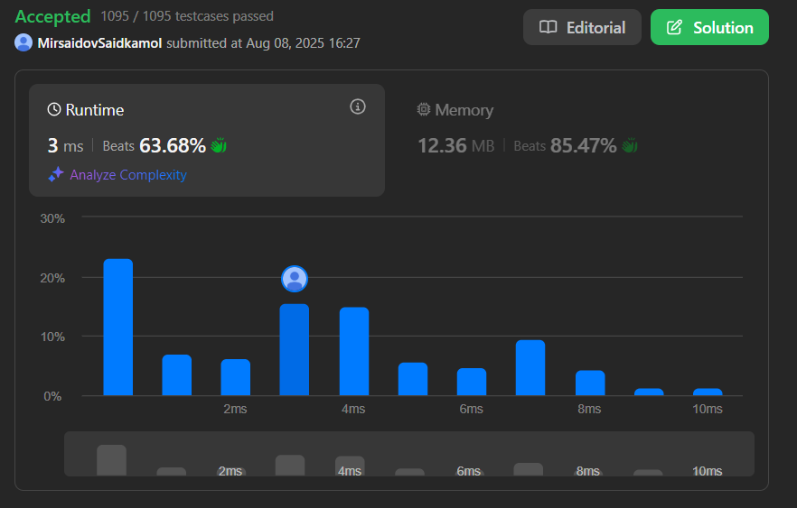

# Add Binary

Difficulty: MEDIUM.

[View this problem on Leetcode](https://leetcode.com/problems/string-to-integer-atoi/)

## Description

Implement the `myAtoi(string s)` function, which converts a string to a 32-bit signed integer.

The algorithm for `myAtoi(string s)` is as follow:

1. **Whitespace:** Ignore any leading(`" "`).
2. **Signedness:** Determine the sign by checking if the next character is `'-'` or `'+'`, assuming positivity if neither present.
3. **Conversion:** Read the integer by skipping leading zeros until a non-digit character is encountered or the end of the string is reached. If no digits were read, then the result is 0.
4. **Rounding:** If the integer is out 32-bit signed integer range `[-2**31, 2**31 - 1]`, then round the integer to remain in the range. Specifically, integers less than `-2**31` should be rounded to `-2**31`, and integers greater than `2**31 - 1` should be rounded to `2**31 - 1`.

Return the integer as the final result.

## Examples

**Input:** s = "42"
**Output:** 42

**Input:** s = " -042"
**Output:** -42

**Input:** s = "1337c0d3"
**Output:** 1337

**Input:** s = "0-1"
**Output:** 0

**Input:** s = "words and 987"
**Output:** 0

## Result

