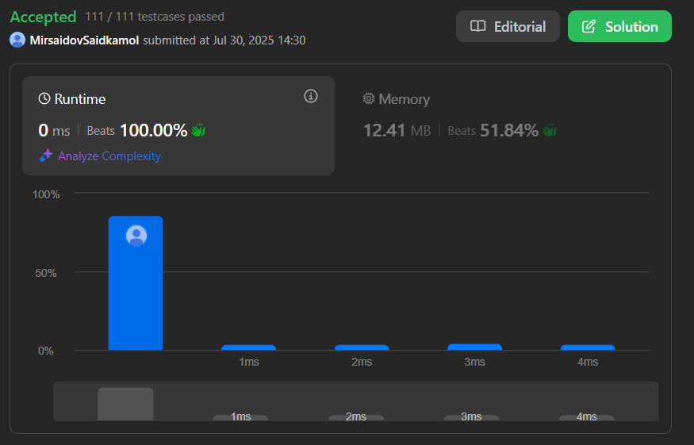

# Plus one

Difficulty: EASY.

[View this problem on Leetcode](https://leetcode.com/plus-one/)

## Description

You are given a **large integer** represented as an integer array `digits`, where each `digits[i]` is the `i`th digit of integer. The digits are ordered from most significant to least significant in left-to-right order. The lrge integer does not contain any leading `0`'s.

Increment the large integer by one and return __the resulting array of digits__.

## Examples

**Input:** digits = [1, 2, 3]
**Output:** [1, 2, 4]

**Input:** nums = [4, 3, 2, 1]
**Output:** [4, 3, 2, 2]

**Input:** nums = [9]
**Output:** [1, 0]

## Result

