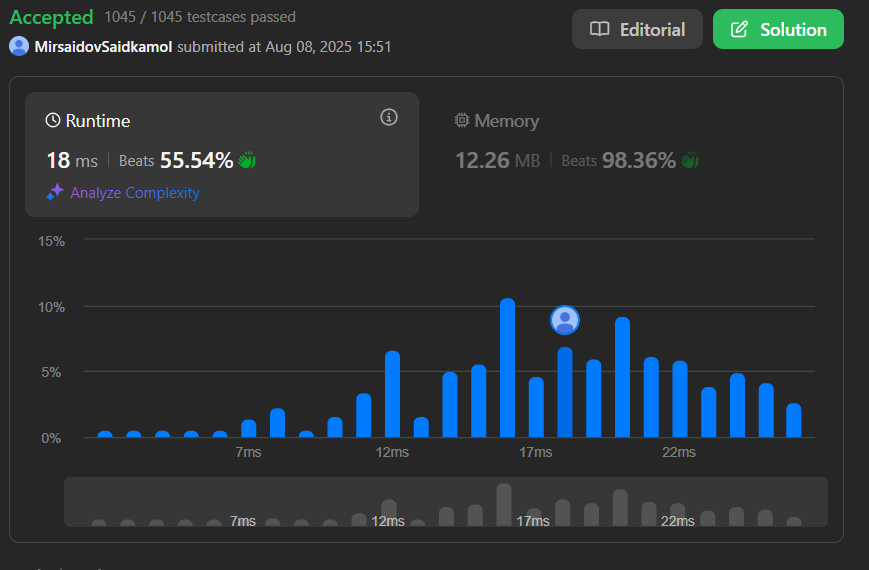

# Add Binary

Difficulty: MEDIUM.

[View this problem on Leetcode](https://leetcode.com/problems/reverse-integer/)

## Description

Given a signed 32-bit integer `x`, return `x` _with its digits reversed_. If reversin `x` causes the value to go outside the signed 32-bit integer range `[-21**31, 2**31 - 1]`, then return `0`.

**Assume the environment does not allow you to store 64-bit integers (signed or unsigned).**

## Examples

**Input:** x = 123
**Output:** 321

**Input:** x = -123
**Output:** -321

**Input:** x = 120
**Output:** 21

## Result

